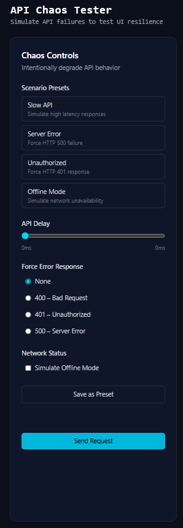
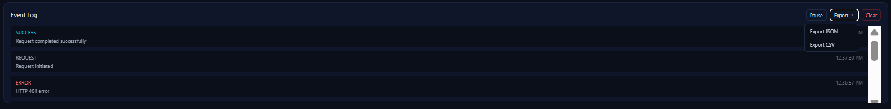
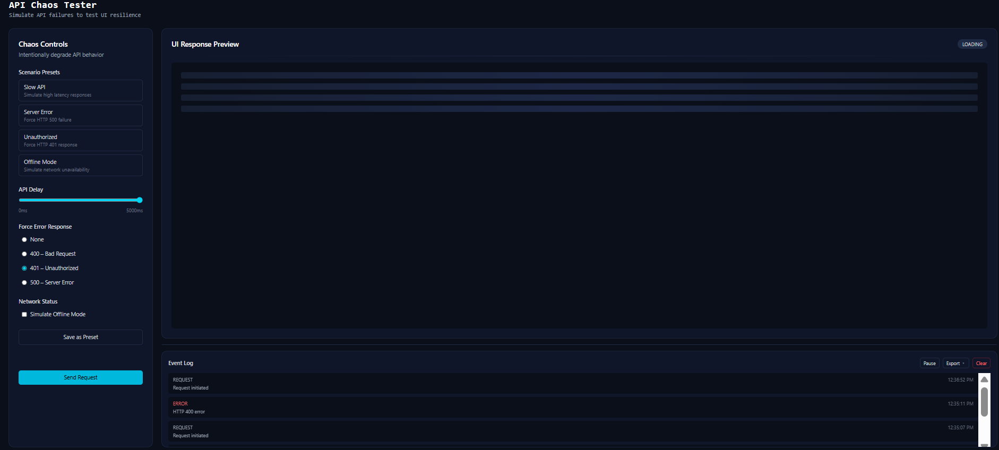

# 🧪 API Chaos Tester (Frontend)

A frontend-only tool to **simulate real-world API failure scenarios**—latency, errors, offline states—and observe how a UI behaves under stress.

Built to demonstrate **production-grade async handling**, **state-driven UI**, and **tool design thinking**.

---

## 🚀 What problem does this solve?

Most frontend bugs happen **when APIs fail**, not when they succeed.

This tool helps developers:

* Test loading states realistically
* Validate error handling UX
* Prevent race conditions
* Observe request behavior under stress

All **without a backend**.

---

## ✨ Core Features

* **Chaos Simulation** – delay, HTTP errors, offline mode
* **Abort-safe requests** – no race conditions, no stale UI
* **Scenario Presets** – common failures in one click
* **Custom Presets** – save & reuse your own scenarios
* **Event Log Panel** – request lifecycle observability
* **Retry that actually works** – same logic, no duplication
* **Log Export** – JSON or CSV (user chooses)
* **Responsive Tool UI** – desktop canvas, mobile-friendly

---

## 🖼 Screenshots

> Screenshots are intentionally structured to explain behavior.

### 1️⃣ Chaos Controls + Presets

**What you see:**

* Scenario presets (Slow API, Offline, Server Error)
* Manual fine-tuning controls
* Save-as-preset action

**Why it matters:**

* Intent-driven testing
* Presets + manual controls working together



---

### 2️⃣ Event Log with Export Options

**What you see:**

* Request lifecycle logs (request, success, error, abort)
* Export popover with JSON / CSV options
* Pause and clear log controls

**Why it matters:**

* Observability-first design
* Logs are accurate, exportable, and user-controlled
* Supports debugging and reporting workflows



---

### 3️⃣ Loading State

**What you see:**

* Skeleton UI during delayed requests
* Loading indicator tied to real async execution

**Why it matters:**

* AbortController prevents stale responses
* Only the latest request updates the UI
* No race conditions under rapid interaction



---

### 4️⃣ Error State with Retry

**What you see:**

* Error response UI with status
* Retry action

**Why it matters:**

* Retry reuses the same centralized request logic
* No duplicated async code paths
* Honest UX: retry does exactly what users expect


---

### 5️⃣ Idle State

**What you see:**

* Initial neutral UI before any request is made

**Why it matters:**

* State-driven rendering
* No disabled or misleading UI
* Clear starting point for user interaction


---

## 🧠 Key Architectural Decisions

### Centralized request execution

* Send & Retry use the same logic
* Abort handling is consistent
* Logs always reflect real transitions

### AbortController-based safety

* Prevents race conditions
* Prevents stale UI updates
* Prevents misleading logs

### Presets over raw configuration

* Presets encode **intent**, not just values
* Manual controls remain for fine-tuning

### Logging as a side-effect

* Logging can be paused
* Logs don’t affect execution
* Logs are exportable evidence

---

## 🧩 Tech Stack

* React (Vite)
* Context API
* Tailwind CSS
* AbortController
* localStorage

*No UI libraries. No backend.*

---

## ▶️ Run Locally

```bash
npm install
npm run dev
```

---

## 🎯 What this project demonstrates

* Async correctness under stress
* Tool-oriented UI design
* Clean separation of concerns
* Observability & debuggability
* Honest UX (no fake buttons)

This is **not** a CRUD app or a UI clone.

---

## 👋 About

Built as a **portfolio-grade project** to demonstrate frontend engineering beyond rendering—focused on **resilience, correctness, and developer experience**.
